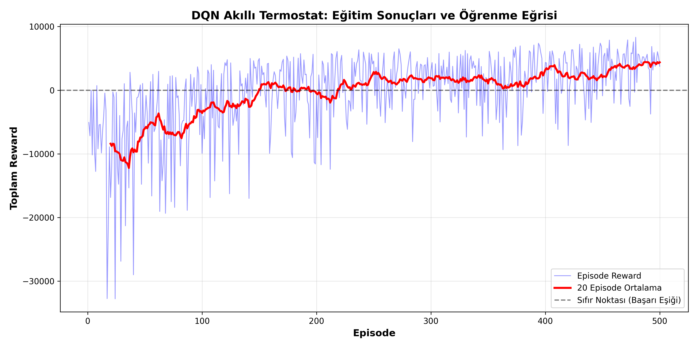
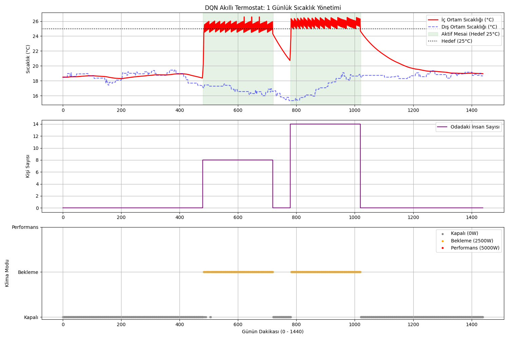
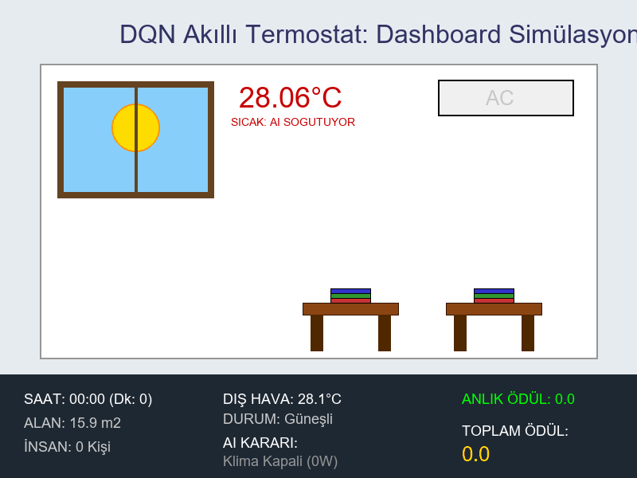

# 🌡️ DQN Otonom Enerji Tasarrufu

Bu proje, ofis ortamlarında kullanılan HVAC/klima sistemlerinin enerji tüketimini azaltırken iç ortam konforunu korumayı hedefleyen **Deep Q-Network (DQN)** tabanlı bir akıllı termostat simülasyonudur.

Ajan; dış sıcaklık, iç sıcaklık, gün içi zaman, yalıtım katsayısı ve ofisteki insan sayısı gibi çevresel durumları gözlemleyerek klimayı hangi güç modunda çalıştıracağına karar verir. Amaç, özellikle mesai saatlerinde iç ortam sıcaklığını **25°C** hedef sıcaklığa yakın tutarken gereksiz enerji tüketimini azaltmaktır.

---

## İçindekiler

1. Proje amacı
2. Kullanılan teknolojiler
3. Proje dosya yapısı
4. Markov Karar Süreci (MDP)
5. State / Action / Reward
6. Termodinamik ortam modeli
7. Deep Q-Network mimarisi
8. DQN öğrenme formülleri
9. Hiperparametreler
10. Kurulum
11. Kullanım
12. Görsel çıktılar
13. Örnek terminal çıktıları
14. Sonuç ve yorum


---

## Proje amacı

Geleneksel termostat sistemleri çoğunlukla sabit eşik değerlerine göre çalışır. Bu yaklaşım, bazı durumlarda gereksiz enerji tüketimine veya konfor kaybına neden olabilir. Bu projede ise termostat kontrolü, sabit kurallardan ziyade pekiştirmeli öğrenme yaklaşımıyla modellenmiştir.

Ajanın temel hedefleri:

- Mesai saatlerinde iç sıcaklığı 25°C civarında tutmak
- Mesai dışı saatlerde gereksiz klima kullanımını azaltmak
- Farklı dış sıcaklık, oda büyüklüğü, yalıtım ve insan sayısı senaryolarına uyum sağlamak
- Enerji tüketimi ile termal konfor arasında denge kurmak
- Öğrenilmiş politika ile otonom klima kontrolü gerçekleştirmek

---

## Kullanılan teknolojiler

| Teknoloji | Kullanım amacı |
|---|---|
| Python | Ana programlama dili |
| PyTorch | DQN sinir ağı ve eğitim süreci |
| NumPy | Sayısal işlemler ve veri saklama |
| Matplotlib | Eğitim ve test grafiklerinin oluşturulması |
| Pillow | Dashboard görsellerinin çizimi |
| ImageIO | GIF çıktısı oluşturma |
| Deep Q-Network | Pekiştirmeli öğrenme algoritması |
| Experience Replay | Geçmiş deneyimlerden mini-batch öğrenme |
| Target Network | DQN eğitim kararlılığını artırma |

---

## Proje dosya yapısı

```text
DQN-Otonom-Enerji-Tasarrufu/
│
├── env.py                  # Ofis ortamı, termodinamik model ve reward sistemi
├── agent.py                # DQN ağı, replay buffer ve ajan karar mekanizması
├── train.py                # Eğitim döngüsü
├── evaluate.py             # Eğitilmiş model ile 1 günlük test simülasyonu
├── plot_training.py        # Eğitim reward grafiği üretimi
├── gif_thermostat.py       # Dashboard GIF simülasyonu
│
├── dqn_model.pth           # Eğitilmiş model ağırlıkları
├── reward_history.npy      # Episode bazlı reward geçmişi
├── dqn_egitim_grafigi.png  # Eğitim grafiği çıktısı
├── dqn_test_sonuclari.png   # Test simülasyonu grafiği
├── smart_thermostat_dashboard.gif # Dashboard simülasyon çıktısı
│
├── requirements.txt        # Gerekli Python paketleri
└── README.md             # Birleştirilmiş proje dokümantasyonu
```

---

## Markov Karar Süreci Modeli

Bu proje, ofis içi klima kontrol problemini bir **Markov Karar Süreci (MDP)** olarak ele alır.

\[
MDP = \langle S, A, P, R, \gamma \rangle
\]

| Sembol | Açıklama |
|---|---|
| \(S\) | State space, yani ajan tarafından gözlemlenen durumlar |
| \(A\) | Action space, yani ajanın seçebileceği aksiyonlar |
| \(P\) | Transition model, yani bir durumdan diğerine geçiş dinamiği |
| \(R\) | Reward function, yani ajanın aldığı ödül/ceza |
| \(\gamma\) | Discount factor, yani gelecekteki ödüllerin bugünkü karara etkisi |

Bu projede ajan her dakika ortamı gözlemler, bir klima modu seçer, ortam termodinamik modele göre güncellenir ve ajan seçtiği aksiyona göre ödül veya ceza alır.

---

## State / Action / Reward

### 1) State (Durum uzayı)

Ajanın her zaman adımında aldığı durum vektörü 5 değişkenden oluşur:

\[
s_t = [m_t, T_{ext,t}, T_{in,t}, U, N_t]
\]

| Değişken | Açıklama | Kod karşılığı |
|---|---|---|
| \(m_t\) | Gün içerisindeki dakika değeri | `current_step` |
| \(T_{ext,t}\) | Dış ortam sıcaklığı | `outside_temp` |
| \(T_{in,t}\) | İç ortam sıcaklığı | `real_temp` |
| \(U\) | Odanın yalıtım katsayısı | `u_value` |
| \(N_t\) | Ofisteki insan sayısı | `num_humans` |

\[
s_t \in \mathbb{R}^5
\]

Kodda state vektörü PyTorch ile uyumlu olacak şekilde `float32` NumPy dizisi olarak döndürülür.

```python
return np.array([
    self.current_step,
    self.outside_temp,
    self.real_temp,
    self.u_value,
    self.num_humans
], dtype=np.float32)
```

### 2) Action (Aksiyon uzayı)

Ajanın seçebileceği aksiyonlar ayrık bir action space olarak tanımlanmıştır:

\[
A = \{0, 1, 2\}
\]

| Action | Klima modu | Güç değeri |
|---:|---|---:|
| 0 | Klima kapalı | 0 W |
| 1 | Bekleme modu | 2500 W |
| 2 | Performans modu | 5000 W |

Aksiyon-güç eşlemesi:

\[
P(a_t) =
\begin{cases}
0, & a_t = 0 \\
2500, & a_t = 1 \\
5000, & a_t = 2
\end{cases}
\]

Bu aksiyonlar üzerinden ajan, iç ortam sıcaklığına ve mesai durumuna göre enerji/konfor dengesini öğrenir.

### 3) Reward (Ödül fonksiyonu)

Ödül fonksiyonu, ajanın hem konforu sağlamasını hem de enerji tüketimini azaltmasını hedefler.

\[
R_t = R_{comfort} + R_{occupancy} + R_{energy}
\]

#### Mesai saatlerinde konfor ödülü/cezası

Mesai saatlerinde hedef sıcaklık:

\[
T_{target} = 25^\circ C
\]

Sıcaklık farkı:

\[
d_t = |T_{target} - T_{in,t}|
\]

Mesai saatlerinde konfor reward'u:

\[
R_{comfort} =
\begin{cases}
+20, & d_t \leq 1 \\
-2 \cdot d_t^2, & d_t > 1
\end{cases}
\]

Bu yapı sayesinde hedef sıcaklığa yakın durumlar ödüllendirilirken, hedef sıcaklıktan uzaklaşma karesel olarak cezalandırılır.

#### Mesai dışı gereksiz kullanım cezası

Mesai dışı saatlerde ve hazırlık aralığı dışında klima açılırsa ajan ceza alır:

\[
R_{occupancy} =
\begin{cases}
-10, & t \notin W,\ t \notin P_{prep},\ a_t > 0 \\
0, & \text{diğer durumlar}
\end{cases}
\]

#### Enerji tüketim cezası

Klima gücü arttıkça enerji cezası da artar:

\[
R_{energy} =
\begin{cases}
0, & a_t = 0 \\
-1, & a_t = 1 \\
-3, & a_t = 2
\end{cases}
\]

---

## Termodinamik ortam modeli

Ortam modeli, basitleştirilmiş bir ofis termodinamiği üzerine kuruludur. Her episode yeni bir günü temsil eder ve bir gün toplam **1440 dakika** olarak simüle edilir.

### Ortam başlangıç değerleri

Her episode başında bazı değerler rastgele atanır:

| Parametre | Değer aralığı / değer | Açıklama |
|---|---|---|
| Oda alanı | \(A_{room} \sim U(10, 50)\) m² | Her episode farklı oda büyüklüğü |
| Oda yüksekliği | 2.8 m | Sabit tavan yüksekliği |
| Yalıtım katsayısı | \(U \sim U(0.4, 0.9)\) | Odanın ısı geçirgenliği |
| Dış sıcaklık | \(T_{ext} \sim U(-10, 35)\) °C | Gün başlangıcı dış sıcaklığı |
| İnsan sayısı | 0 veya 5-15 | Mesai saatlerine göre değişir |

### Mesai programı

Ofis doluluk durumu mesai saatlerine göre belirlenmiştir:

| Zaman aralığı | Durum |
|---|---|
| 08:00 - 12:00 | Aktif mesai |
| 12:00 - 13:00 | Öğle arası |
| 13:00 - 17:00 | Aktif mesai |
| Diğer saatler | Mesai dışı |

Kodda dakika karşılığı:

\[
W = [480,720) \cup [780,1020)
\]

Mesai başlangıcından önce hazırlık yapılabilmesi için ayrıca iki hazırlık aralığı kullanılmıştır:

\[
P_{prep} = [450,480) \cup [750,780)
\]

Bu hazırlık aralıklarında ajan klimayı açarsa mesai dışı cezası almaz. Böylece ajan, mesai başlamadan önce ortamı hedef sıcaklığa yaklaştırmayı öğrenebilir.

### Isı geçiş modeli

İç sıcaklık değişimi üç ana ısı bileşeniyle hesaplanır:

- Dış ortamdan gelen/giden ısı etkisi
- İnsanlardan kaynaklanan iç ısı yükü
- Klimanın ısıtma veya soğutma etkisi

#### 1. Isı sızıntısı

\[
\dot{Q}_{leak} = U \cdot A_{room} \cdot (T_{ext,t} - T_{in,t})
\]

#### 2. İç ısı yükü

\[
\dot{Q}_{internal} = N_t \cdot 125
\]

#### 3. HVAC etkisi

\[
\dot{Q}_{AC} =
\begin{cases}
+P(a_t), & T_{in,t} < 24.5 \\
-P(a_t), & T_{in,t} > 25.5 \\
0, & 24.5 \leq T_{in,t} \leq 25.5
\end{cases}
\]

#### 4. İç sıcaklık güncellemesi

\[
C_{room} = A_{room} \cdot h \cdot \rho_{air} \cdot c_{p,air}
\]

\[
\Delta T_{in} = \frac{(\dot{Q}_{leak} + \dot{Q}_{internal} + \dot{Q}_{AC}) \cdot \Delta t}{C_{room}}
\]

\[
T_{in,t+1} = T_{in,t} + \Delta T_{in}
\]

---

## Deep Q-Network mimarisi

Projede kullanılan DQN modeli, tam bağlantılı katmanlardan oluşan basit ama etkili bir yapay sinir ağıdır.

### Model mimarisi

- Input Layer: 5 nöron
- Hidden Layer 1: 64 nöron + ReLU
- Hidden Layer 2: 64 nöron + ReLU
- Output Layer: 3 nöron

\[
h_1 = ReLU(W_1 s_t + b_1)
\]

\[
h_2 = ReLU(W_2 h_1 + b_2)
\]

\[
Q(s_t, a; \theta) = W_3 h_2 + b_3
\]

Çıkış katmanında 3 değer üretilir:

\[
Q(s_t, a_0),\ Q(s_t, a_1),\ Q(s_t, a_2)
\]

Bu değerler, ilgili aksiyonların beklenen uzun vadeli toplam ödülünü temsil eder. Ajan, keşif yapmadığı durumlarda en yüksek Q-değerine sahip aksiyonu seçer.

---

## DQN öğrenme formülleri

### Q-Learning güncelleme mantığı

Klasik Q-learning hedefi:

\[
Q(s_t,a_t) \leftarrow Q(s_t,a_t) + \alpha \left[r_t + \gamma \max_{a'} Q(s_{t+1},a') - Q(s_t,a_t)\right]
\]

DQN'de tablo yerine sinir ağı kullanılır:

\[
Q(s,a;\theta)
\]

Burada \(\theta\), sinir ağının öğrenilebilir ağırlıklarıdır.

### Bellman target

\[
y_t = r_t + \gamma \max_{a'} Q_{target}(s_{t+1}, a'; \theta^-) \cdot (1 - done)
\]

Episode bittiyse gelecek ödül hesaba katılmaz.

### Loss function

\[
L(\theta) = \frac{1}{N} \sum_{i=1}^{N} \left(y_i - Q_{policy}(s_i,a_i;\theta)\right)^2
\]

### Target network

Target network, belirli aralıklarla policy network ağırlıklarıyla güncellenir:

\[
\theta^- \leftarrow \theta
\]

Bu projede target network her **10 episode** sonunda güncellenir.

### Experience replay

\[
D = \{(s_t, a_t, r_t, s_{t+1}, done_t)\}
\]

Replay buffer kapasitesi:

\[
|D|_{max} = 10000
\]

### Epsilon-greedy policy

\[
a_t =
\begin{cases}
\text{random action}, & \text{olasılık } \epsilon \\
\arg\max_a Q(s_t,a;\theta), & \text{olasılık } 1 - \epsilon
\end{cases}
\]

Epsilon azalımı:

\[
\epsilon_{episode+1} = \epsilon_{episode} \cdot 0.995
\]

Alt sınır:

\[
\epsilon_{min} = 0.01
\]

500 episode sonunda epsilon yaklaşık olarak şu seviyeye iner:

\[
\epsilon_{500} \approx 1.0 \cdot 0.995^{500} \approx 0.082
\]

---

## Hiperparametreler

### Eğitim hiperparametreleri

| Parametre | Değer | Açıklama |
|---|---|---|
| Episode sayısı | 500 | Ajanın 500 farklı gün senaryosunda eğitilmesi |
| Max step | 1440 | Her episode 1 gün, yani 1440 dakika |
| Batch size | 64 | Replay buffer'dan çekilen mini-batch boyutu |
| Discount factor \(\gamma\) | 0.99 | Gelecekteki ödüllerin önemi |
| Learning rate | 0.001 | Adam optimizer öğrenme hızı |
| Optimizer | Adam | Sinir ağı ağırlık güncellemesi |
| Loss function | MSELoss | Bellman hedefi ile tahmin farkı |
| Replay buffer capacity | 10000 | Saklanan maksimum deneyim sayısı |
| Target update frequency | 10 episode | Target network güncelleme aralığı |
| Initial epsilon | 1.0 | Başlangıç keşif oranı |
| Minimum epsilon | 0.01 | Minimum keşif oranı |
| Epsilon decay | 0.995 | Episode sonunda epsilon çarpanı |

### Model hiperparametreleri

| Katman | Giriş | Çıkış | Aktivasyon |
|---|---:|---:|---|
| Linear 1 | 5 | 64 | ReLU |
| Linear 2 | 64 | 64 | ReLU |
| Linear 3 | 64 | 3 | Yok |

### Ortam parametreleri

| Parametre | Değer | Açıklama |
|---|---|---|
| Hedef sıcaklık | 25°C | Mesai saatlerinde hedeflenen iç sıcaklık |
| Konfor aralığı | 24°C - 26°C | Hedef sıcaklığa yakın kabul edilen aralık |
| Hazırlık aralıkları | 07:30-08:00, 12:30-13:00 | Mesai öncesi hazırlık imkanı |
| Mesai saatleri | 08:00-12:00, 13:00-17:00 | Konforun öncelikli olduğu saatler |
| İnsan başına ısı | 125 W | İç ısı yükü |
| Klima kapalı | 0 W | Action 0 |
| Bekleme modu | 2500 W | Action 1 |
| Performans modu | 5000 W | Action 2 |
| Hava yoğunluğu | 1.2 kg/m³ | Termal kütle hesabı |
| Hava özgül ısısı | 1005 J/kgK | Termal kütle hesabı |

---

## Kurulum

Projeyi klonlayın:

```bash
git clone https://github.com/KadirsinasCelik/DQN-Otonom-Enerji-Tasarrufu.git
cd DQN-Otonom-Enerji-Tasarrufu
```

Sanal ortam oluşturun:

```bash
python -m venv venv
```

Windows için sanal ortamı aktif edin:

```bash
venv\Scripts\activate
```

Linux/macOS için:

```bash
source venv/bin/activate
```

Gerekli kütüphaneleri kurun:

```bash
pip install -r requirements.txt
```

requirements.txt içeriği:

```text
torch>=2.0.0
numpy>=1.21.0
matplotlib>=3.5.0
imageio>=2.31.0
pillow>=10.0.0
```

---

## Kullanım

### 1. Modeli eğitme

```bash
python train.py
```

Eğitim tamamlandığında şu dosyalar oluşur:

- `dqn_model.pth`
- `reward_history.npy`

### 2. Eğitim grafiği oluşturma

```bash
python plot_training.py
```

Çıktı:

- `dqn_egitim_grafigi.png`

### 3. Eğitilmiş modeli test etme

```bash
python evaluate.py
```

Çıktı:

- `dqn_test_sonuclari.png`

### 4. Dashboard GIF üretme

```bash
python gif_thermostat.py
```

Çıktı:

- `smart_thermostat_dashboard.gif`

---

## Görsel çıktılar

### Eğitim eğrisi

Ajanın 500 episode boyunca aldığı toplam reward değerleri ve hareketli ortalama eğrisi.



### 1 günlük test simülasyonu

Eğitilmiş ajanın 1 günlük test senaryosunda iç sıcaklık, dış sıcaklık, insan sayısı ve klima aksiyonlarını gösteren grafik.



### Dashboard simülasyonu

Ajanın kararlarını görsel olarak sunan dashboard GIF çıktısı.



---

## Örnek terminal çıktıları

Aşağıda eğitim, grafik, değerlendirme ve GIF üretim süreçlerine ait tam terminal çıktısı gösterilmiştir:

```text
PS C:\Users\Kadir\Desktop\DQN Otonom Enerji Tasarrufu> python train
C:\Users\Kadir\AppData\Local\Programs\Python\Python38\python.exe: can't open file 'train': [Errno 2] No such file or directory
PS C:\Users\Kadir\Desktop\DQN Otonom Enerji Tasarrufu> python train.py
DQN Eğitim Süreci Başlıyor...
--------------------------------------------------
Bölüm: 10/500 | Ortalama Ödül: -5888.73 | Keşif Oranı (Epsilon): 0.951
Bölüm: 20/500 | Ortalama Ödül: -10920.12 | Keşif Oranı (Epsilon): 0.905
Bölüm: 30/500 | Ortalama Ödül: -11175.32 | Keşif Oranı (Epsilon): 0.860
Bölüm: 40/500 | Ortalama Ödül: -8315.99 | Keşif Oranı (Epsilon): 0.818
Bölüm: 50/500 | Ortalama Ödül: -3744.04 | Keşif Oranı (Epsilon): 0.778
Bölüm: 60/500 | Ortalama Ödül: -4741.26 | Keşif Oranı (Epsilon): 0.740
Bölüm: 70/500 | Ortalama Ödül: -8379.16 | Keşif Oranı (Epsilon): 0.704
Bölüm: 80/500 | Ortalama Ödül: -4790.38 | Keşif Oranı (Epsilon): 0.670
Bölüm: 90/500 | Ortalama Ödül: -5587.80 | Keşif Oranı (Epsilon): 0.637
Bölüm: 100/500 | Ortalama Ödül: -1573.48 | Keşif Oranı (Epsilon): 0.606
Bölüm: 110/500 | Ortalama Ödül: -2240.06 | Keşif Oranı (Epsilon): 0.576
Bölüm: 120/500 | Ortalama Ödül: -3166.04 | Keşif Oranı (Epsilon): 0.548
Bölüm: 130/500 | Ortalama Ödül: -2476.69 | Keşif Oranı (Epsilon): 0.521
Bölüm: 140/500 | Ortalama Ödül: -664.70 | Keşif Oranı (Epsilon): 0.496
Bölüm: 150/500 | Ortalama Ödül: 1002.26 | Keşif Oranı (Epsilon): 0.471
Bölüm: 160/500 | Ortalama Ödül: -340.78 | Keşif Oranı (Epsilon): 0.448
Bölüm: 170/500 | Ortalama Ödül: 1272.10 | Keşif Oranı (Epsilon): 0.427
Bölüm: 180/500 | Ortalama Ödül: -624.91 | Keşif Oranı (Epsilon): 0.406
Bölüm: 190/500 | Ortalama Ödül: 1189.35 | Keşif Oranı (Epsilon): 0.386
Bölüm: 200/500 | Ortalama Ödül: -2209.84 | Keşif Oranı (Epsilon): 0.367
Bölüm: 210/500 | Ortalama Ödül: -411.84 | Keşif Oranı (Epsilon): 0.349
Bölüm: 220/500 | Ortalama Ödül: 835.27 | Keşif Oranı (Epsilon): 0.332
Bölüm: 230/500 | Ortalama Ödül: -666.50 | Keşif Oranı (Epsilon): 0.316
Bölüm: 240/500 | Ortalama Ödül: 2347.15 | Keşif Oranı (Epsilon): 0.300
Bölüm: 250/500 | Ortalama Ödül: 3358.41 | Keşif Oranı (Epsilon): 0.286
Bölüm: 260/500 | Ortalama Ödül: 633.83 | Keşif Oranı (Epsilon): 0.272
Bölüm: 270/500 | Ortalama Ödül: 1182.95 | Keşif Oranı (Epsilon): 0.258
Bölüm: 280/500 | Ortalama Ödül: 2340.91 | Keşif Oranı (Epsilon): 0.246
Bölüm: 290/500 | Ortalama Ödül: 1139.60 | Keşif Oranı (Epsilon): 0.234
Bölüm: 300/500 | Ortalama Ödül: 2636.07 | Keşif Oranı (Epsilon): 0.222
Bölüm: 310/500 | Ortalama Ödül: 1281.89 | Keşif Oranı (Epsilon): 0.211
Bölüm: 320/500 | Ortalama Ödül: 1924.97 | Keşif Oranı (Epsilon): 0.201
Bölüm: 330/500 | Ortalama Ödül: 1824.47 | Keşif Oranı (Epsilon): 0.191
Bölüm: 340/500 | Ortalama Ödül: 2032.08 | Keşif Oranı (Epsilon): 0.182
Bölüm: 350/500 | Ortalama Ödül: 94.10 | Keşif Oranı (Epsilon): 0.173
Bölüm: 360/500 | Ortalama Ödül: 1609.67 | Keşif Oranı (Epsilon): 0.165
Bölüm: 370/500 | Ortalama Ödül: 322.93 | Keşif Oranı (Epsilon): 0.157
Bölüm: 380/500 | Ortalama Ödül: 1155.04 | Keşif Oranı (Epsilon): 0.149
Bölüm: 390/500 | Ortalama Ödül: 2899.13 | Keşif Oranı (Epsilon): 0.142
Bölüm: 400/500 | Ortalama Ödül: 3532.28 | Keşif Oranı (Epsilon): 0.135
Bölüm: 410/500 | Ortalama Ödül: 2857.76 | Keşif Oranı (Epsilon): 0.128
Bölüm: 420/500 | Ortalama Ödül: 1332.76 | Keşif Oranı (Epsilon): 0.122
Bölüm: 430/500 | Ortalama Ödül: 3254.52 | Keşif Oranı (Epsilon): 0.116
Bölüm: 440/500 | Ortalama Ödül: 704.17 | Keşif Oranı (Epsilon): 0.110
Bölüm: 450/500 | Ortalama Ödül: 3371.76 | Keşif Oranı (Epsilon): 0.105
Bölüm: 460/500 | Ortalama Ödül: 3943.74 | Keşif Oranı (Epsilon): 0.100
Bölüm: 470/500 | Ortalama Ödül: 3592.33 | Keşif Oranı (Epsilon): 0.095
Bölüm: 480/500 | Ortalama Ödül: 3888.69 | Keşif Oranı (Epsilon): 0.090
Bölüm: 490/500 | Ortalama Ödül: 4896.30 | Keşif Oranı (Epsilon): 0.086
Bölüm: 500/500 | Ortalama Ödül: 3867.91 | Keşif Oranı (Epsilon): 0.082
--------------------------------------------------
Eğitim Tamamlandı! Model 'dqn_model.pth' olarak kaydediliyor...
Eğitim geçmişi 'reward_history.npy' olarak başarıyla kaydedildi!
Kaydedildi. Artık test aşamasına ve grafik çizimine geçebiliriz!
PS C:\Users\Kadir\Desktop\DQN Otonom Enerji Tasarrufu> python plot_training.py
Organik eğitim verileri okunuyor...
Şov Zamanı! Profesyonel eğitim grafiği 'dqn_egitim_grafigi.png' adıyla kaydedildi.
PS C:\Users\Kadir\Desktop\DQN Otonom Enerji Tasarrufu> python evaluate.py
Test simülasyonu başlatılıyor...
Eğitilmiş model başarıyla yüklendi!
Test Günü Toplam Ödülü: 6768.66
PS C:\Users\Kadir\Desktop\DQN Otonom Enerji Tasarrufu> python gif_thermostat.py
Dashboard GIF Simülasyonu başlatılıyor (DQN Entegreli)...
Model yüklendi. Görseller işleniyor...
İşlem tamam! 'smart_thermostat_dashboard.gif' klasörüne kaydedildi.
PS C:\Users\Kadir\Desktop\DQN Otonom Enerji Tasarrufu> 
```

---

## Sonuç ve yorum

Eğitim sürecinde ajan başlangıçta yüksek keşif oranı nedeniyle rastgele klima kararları verir. Episode sayısı arttıkça epsilon değeri azalır ve ajan daha bilinçli kararlar üretmeye başlar.

Modelin öğrendiği temel davranışlar:

- Mesai saatlerinde iç sıcaklığı hedef değer olan 25°C civarında tutmak
- Hedef sıcaklıktan sapma büyüdüğünde daha güçlü klima modunu seçmek
- Hedef sıcaklığa yaklaştığında enerji tasarrufu için daha düşük güç veya kapalı mod tercih etmek
- Mesai dışı saatlerde gereksiz klima kullanımını azaltmak
- Hazırlık saatlerinde ortamı mesaiye önceden hazırlamak

Örnek test çalıştırmasında model yaklaşık **6700+** toplam reward seviyesine ulaşmıştır. Ortam başlangıç değerleri rastgele üretildiği için test reward değeri her çalıştırmada bir miktar değişebilir.

---

